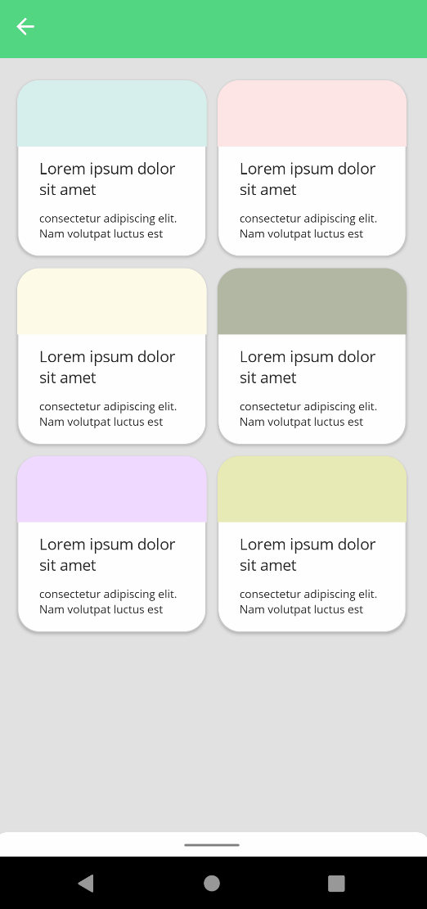
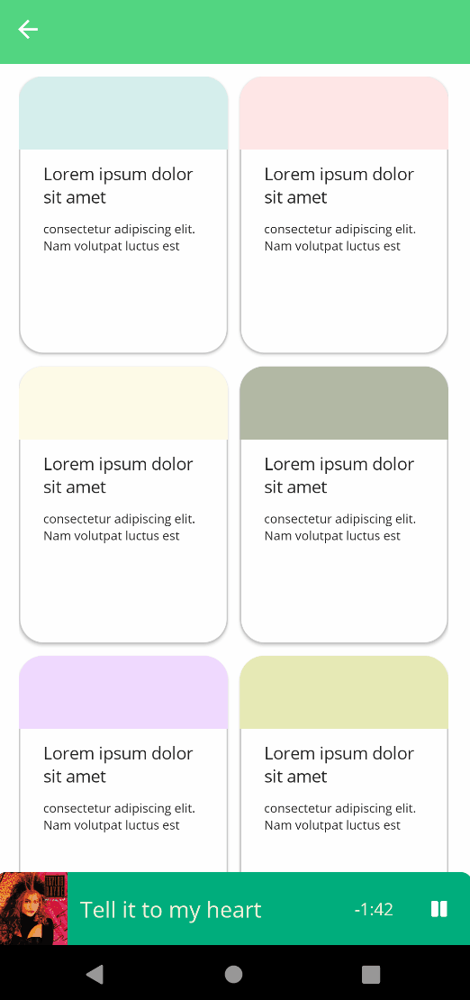

# Bottom Sheet
Bottom sheets are surfaces containing supplementary content that are anchored to the bottom of the screen.

You may visit [Material Design Bottom Sheets](https://material.io/components/sheets-bottom) to get more information.


| Regular | Custom Header |
| --- | --- |
|  |  |

## Usage
Bottom Sheet is an [attachment](../../../infrastructure/UraniumContentPage.md#attachments) of [UraniumContentPage](../../../infrastructure/UraniumContentPage.md). So, it can be used only together with UraniumContentPage.

BottomSheet has a default regular anchor that user can pull it up and down. But, you can also use a custom header to expand and collapse the bottom sheet. Custom headers are automatically allows to drag the bottom sheet up and down. If you want to disable dragging it up and down, you can set `InputTransparent` property to `true` and manage it via code.

Before starting to use BottomSheet, you should add material namespace to your XAML file.

    `xmlns:material="clr-namespace:UraniumUI.Material.Attachments;assembly=UraniumUI.Material"`

To use a regular bottom sheet, you should add a `BottomSheet` to `UraniumContentPage.Attachments`.

```xml
<uranium:UraniumContentPage x:Class="App1.MainPage"
            xmlns="http://schemas.microsoft.com/dotnet/2021/maui"
            xmlns:x="http://schemas.microsoft.com/winfx/2009/xaml"
            xmlns:uranium="clr-namespace:UraniumUI.Pages;assembly=UraniumUI"
            xmlns:material="clr-namespace:UraniumUI.Material.Attachments;assembly=UraniumUI.Material">

    <!-- Content here -->

    <uranium:UraniumContentPage.Attachments>
         <material:BottomSheetView>
            <TableView Intent="Menu" Margin="0,0,0,40">
                <TableRoot>
                    <TableSection Title="Chapters">
                        <TextCell Text="1. Introduction to .NET MAUI"
                    Detail="Learn about .NET MAUI and what it provides." />
                        <TextCell Text="2. Anatomy of an app"
                    Detail="Learn about the visual elements in .NET MAUI" />
                        <TextCell Text="3. Text"
                    Detail="Learn about the .NET MAUI controls that display text." />
                        <TextCell Text="4. Dealing with sizes"
                    Detail="Learn how to size .NET MAUI controls on screen." />
                        <TextCell Text="5. XAML vs code"
                    Detail="Learn more about creating your UI in XAML." />
                    </TableSection>
                </TableRoot>
            </TableView>
        </material:BottomSheetView>
    </uranium:UraniumContentPage.Attachments>
</uranium:UraniumContentPage>
```

## Properties

### Header
To use a custom header bottom sheet, you should add a `BottomSheet` to `UraniumContentPage.Attachments` and set `BottomSheetView.Header` property.

```xml
<uranium:UraniumContentPage x:Class="App1.MainPage"
            xmlns="http://schemas.microsoft.com/dotnet/2021/maui"
            xmlns:x="http://schemas.microsoft.com/winfx/2009/xaml"
            xmlns:uranium="clr-namespace:UraniumUI.Pages;assembly=UraniumUI"
            xmlns:material="clr-namespace:UraniumUI.Material.Attachments;assembly=UraniumUI.Material">

    <!-- Content here -->

    <uranium:UraniumContentPage.Attachments>

        <material:BottomSheetView>
            <material:BottomSheetView.Header>
                <!-- Bottom Sheet Header here-->
            </material:BottomSheetView.Header>

            <!-- Bottom Sheet Content here -->
        </material:BottomSheetView>
    </uranium:UraniumContentPage.Attachments>
</uranium:UraniumContentPage>
```

### IsPresented
`BottomSheetView.IsPresented` property is used to show or hide the bottom sheet. It is `false` by default. You can set it to `true` to show the bottom sheet. It's a bindable property, you can even bind it in XAML page. You can define `x:Name` for the bottom sheet and use it in your code.

```xml
<uranium:UraniumContentPage x:Class="App1.MainPage"
            xmlns="http://schemas.microsoft.com/dotnet/2021/maui"
            xmlns:x="http://schemas.microsoft.com/winfx/2009/xaml"
            xmlns:uranium="clr-namespace:UraniumUI.Pages;assembly=UraniumUI"
            xmlns:material="clr-namespace:UraniumUI.Material.Attachments;assembly=UraniumUI.Material">

    <!-- Content here -->
    <Button Text="Show" OnClick="ShowBottomSheet" />

    <uranium:UraniumContentPage.Attachments>
        <material:BottomSheetView x:Name="myBottomSheet">
            <!-- Bottom Sheet Content here -->
        </material:BottomSheetView>
    </uranium:UraniumContentPage.Attachments>
</uranium:UraniumContentPage>
```

```csharp
 private void ShowBottomSheet(object sender, EventArgs e)
 {
    myBottomSheet.IsPresented = true;
 }
```

### DisablePageWhenOpened
`BottomSheetView.DisablePageWhenOpened` property is used to disable the page when the bottom sheet is opened. It is `true` by default. You can set it to `false` to disable it. When it's true, the page is disabled and user can't interact with it, user can only interact with BottomSheet and there is an overlay added to the page behing bottom sheet. It's a bindable property.

```xml
    <material:BottomSheetView DisablePageWhenOpened="false">
        <!-- Bottom Sheet Content here -->
    </material:BottomSheetView>
```

_It might be useful if you use bottom sheet for something like filtering the content of page._

### CloseOnTapOutside
`BottomSheetView.CloseOnTapOutside` property is used to close the bottom sheet when user taps outside of it. It is `true` by default. You can set it to `false` to disable it. It's a bindable property.

```xml
    <material:BottomSheetView CloseOnTapOutside="false">
        <!-- Bottom Sheet Content here -->
    </material:BottomSheetView>
``` 